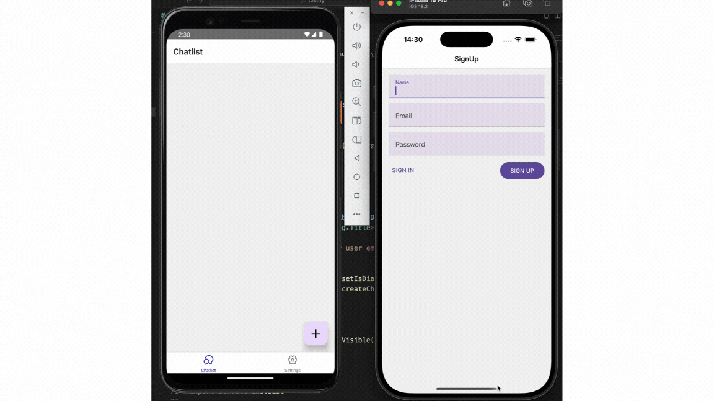

# 📱 Gerçek Zamanlı Chat Uygulaması
- Bu proje, React Native ve Firebase kullanarak geliştirilen gerçek zamanlı bir mesajlaşma uygulamasıdır. Kullanıcılar e-posta ile kayıt olabilir, giriş yapabilir ve diğer kayıtlı kullanıcılarla sohbet başlatabilir.

## 🚀 Özellikler
- ✅ Kullanıcı kayıt ve girişi
- ✅ Gerçek zamanlı mesajlaşma
- ✅ Kullanıcılar, kendi kayıtlı e-postalarıyla başka kayıtlı kullanıcıların e-postasını girerek yeni sohbet başlatabilir.
- ✅ Firebase Firestore kullanarak mesajların senkronize edilmesi
- ✅ Modern ve kullanışlı arayüz

# Screencast
